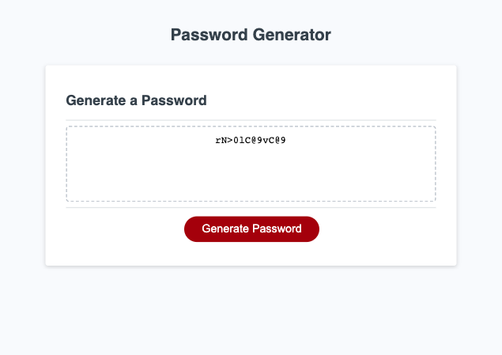

# Module 3 Challenge

## JavaScript Challenge: Password Generator

- Our project goal was go create a functional application that would generate a random password and display it to a page based on specific criteria given
to us by a user.

## Usage

Please visit page in deployed GitHub Pages link provided to try out the password generator: 
